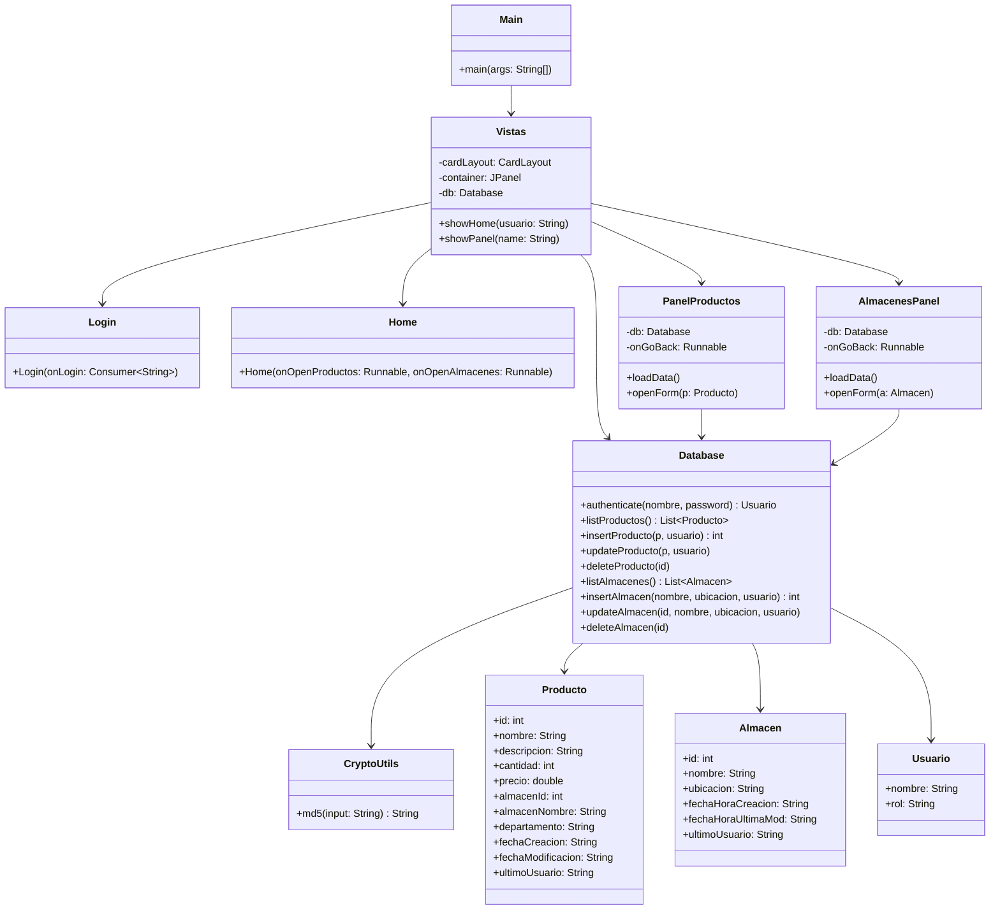
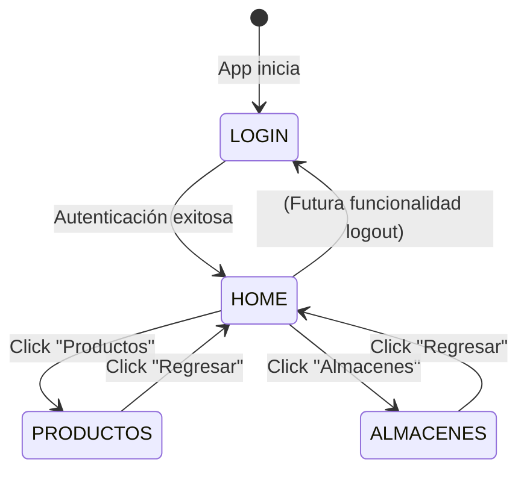

# Sistema de Inventario UNISON

Sistema de gestión de inventario con interfaz gráfica Swing y persistencia en SQLite, desarrollado como proyecto universitario para la Universidad de Sonora.

---

## Tabla de Contenidos

1. [Descripción General](#descripción-general)
2. [Arquitectura del Proyecto](#arquitectura-del-proyecto)
3. [Estructura de Archivos](#estructura-de-archivos)
4. [Diagrama de Clases](#diagrama-de-clases)
5. [Diagrama de Navegación](#diagrama-de-navegación)
6. [Requisitos](#requisitos)
7. [Ejecución](#ejecución)
8. [Usuarios por Defecto](#usuarios-por-defecto)
9. [Mejoras Respecto a la Versión Anterior (V1.0 → V2.0)](#mejoras-respecto-a-la-versión-anterior)
10. [Pruebas](#pruebas)

---

## Descripción General

Aplicación de escritorio Java/Swing que permite gestionar productos y almacenes mediante una interfaz visual. Utiliza SQLite como base de datos local a través del driver JDBC. La autenticación de usuarios está basada en roles con contraseñas hasheadas en MD5.

---

## Arquitectura del Proyecto

El sistema sigue una **arquitectura en capas** con las siguientes responsabilidades:

| Capa | Clases |
|---|---|
| **Presentación** | `Login`, `Home`, `PanelProductos`, `AlmacenesPanel` |
| **Navegación / Controlador** | `Vistas` (CardLayout) |
| **Acceso a datos** | `Database` |
| **Modelos** | `Producto`, `Almacen`, `Usuario` |
| **Utilidades** | `CryptoUtils` |
| **Punto de entrada** | `Main` |

El patrón de navegación central es **CardLayout** gestionado por la clase `Vistas`, que actúa como contenedor y controlador de flujo. Cada panel recibe sus dependencias vía constructor (inyección manual de dependencias).

---

## Estructura de Archivos

```
src/
└── mx/unison/
    ├── Main.java              # Punto de entrada — inicializa Vistas
    ├── Vistas.java            # Controlador de navegación (CardLayout)
    ├── Login.java             # Panel de autenticación
    ├── Home.java              # Dashboard principal
    ├── PanelProductos.java    # CRUD de productos
    ├── AlmacenesPanel.java    # CRUD de almacenes
    ├── Database.java          # Capa de acceso a SQLite
    ├── CryptoUtils.java       # Hash MD5 de contraseñas
    ├── Producto.java          # Modelo de producto
    ├── Almacen.java           # Modelo de almacén
    └── Usuario.java           # Modelo de usuario

test/
└── mx/unison/
    ├── CryptoUtilsTest.java
    └── DatabaseTest.java
```

---

## Diagrama de Clases



---

## Diagrama de Navegación



---

## Requisitos

- Java 17 o superior
- Maven o Gradle (para gestión de dependencias)
- Dependencias:
  - `org.xerial:sqlite-jdbc` — driver SQLite
  - `org.junit.jupiter:junit-jupiter` — pruebas unitarias

La base de datos `Inventario.db` se crea automáticamente en el directorio de ejecución al primer arranque.

---

## Ejecución

```bash
# Con Maven
mvn compile
mvn exec:java -Dexec.mainClass="mx.unison.Main"

# Pruebas
mvn test
```

---

## Usuarios por Defecto

| Usuario | Contraseña | Rol |
|---|---|---|
| `ADMIN` | `admin23` | ADMIN |
| `PRODUCTOS` | `productos19` | PRODUCTOS |
| `ALMACENES` | `almacenes11` | ALMACENES |

> **Nota de seguridad:** Las contraseñas se almacenan como hash MD5. Se recomienda cambiar las contraseñas por defecto en cualquier ambiente que no sea desarrollo local.

---

## Mejoras Respecto a la Versión Anterior

### V1.0 → V2.0: Resumen de Cambios

#### Arquitectura y Navegación

| Aspecto | V1.0 | V2.0 |
|---|---|---|
| Sistema de navegación | `JOptionPane` + relanzar `main()` | `CardLayout` en clase `Vistas` |
| Login | Modal genérico de Swing | Panel dedicado con diseño visual |
| Dashboard | No existía | `Home.java` como centro de navegación |
| Logout | Relanzaba `main(null)` | Regresa a pantalla de login via CardLayout |

#### Funcionalidades Nuevas

- **Módulo de Almacenes completo** (`AlmacenesPanel.java`): listar, crear, modificar y eliminar almacenes con confirmación.
- **Actualización de productos** (`updateProducto()`): la V1.0 solo permitía insertar y eliminar.
- **Campo `departamento`** en productos: nuevo campo en modelo, esquema SQL y formulario.
- **Registro de último inicio de sesión** en la tabla de usuarios.
- **Manejo correcto de NULL en `almacenId`**: se usa `ps.setNull()` cuando el valor es 0 o negativo.

#### Cambios en la Capa de Datos

```
V1.0 Database API:          V2.0 Database API:
- authenticate()            - authenticate()        ← + actualiza sesión
- listProductos(filtros)    - listProductos()       ← + JOIN almacenes + departamento  
- insertProducto()          - insertProducto()      ← + departamento, NULL-safe almacen
- deleteProducto()          - deleteProducto()
                            - updateProducto()      ← NUEVO
                            - listAlmacenes()       ← NUEVO
                            - insertAlmacen()       ← NUEVO
                            - updateAlmacen()       ← NUEVO
                            - deleteAlmacen()       ← NUEVO
```

#### Regresión Identificada

En V1.0, `PanelProductos` ocultaba los botones de edición según el rol del usuario (`canEdit = rol.equals("ADMIN") || rol.equals("PRODUCTOS")`). Esta lógica fue removida en V2.0 — todos los botones son visibles sin importar el rol. **Pendiente de reimplementar.**

---

## Pruebas

### V2.0 — Pruebas Implementadas

**`CryptoUtilsTest`**
- Verifica que `md5("admin23")` retorna el hash exacto esperado (`c289ffe12a30c94530b7fc4e532e2f42`).

**`DatabaseTest`**
- `testInsertAndGetProducto()` — inserta un producto y verifica que el ID generado sea mayor a 0.
- `testUpdateProductoNoDuplica()` — inserta, modifica y verifica que no se creen registros duplicados.
- `testDeleteAlmacen()` — inserta un almacén, lo elimina y verifica que ya no exista en la lista.

### Cobertura Pendiente

- Pruebas de la capa de presentación (Login, PanelProductos, AlmacenesPanel, Vistas).
- Prueba de `authenticate()` con credenciales válidas e inválidas.
- Prueba de `listProductos()` con JOIN de almacenes.

Se recomienda usar **TestFX** para pruebas de la interfaz Swing en futuras iteraciones.
